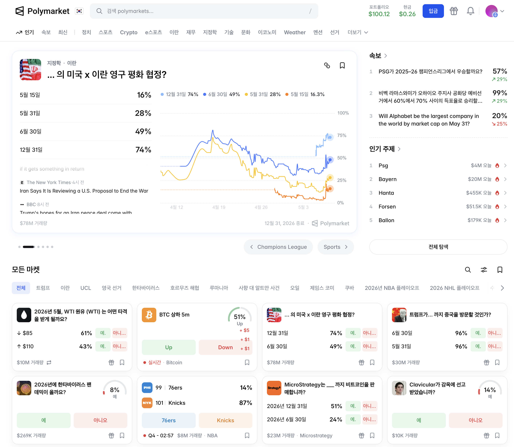

# Verex — Feature Designs

Per-feature design docs for the Verex prediction market, in the **Category → Feature → to-do**
structure. The full **design document & roadmap** is appended below (folded in from the former
`plan/` folder); this top section is the per-feature index.

Status is keyed to the 10-step roadmap (**§1.4 in the design document below**): **S1 ✅ · S2 (current) · S3–S10 planned**.

## Categories
| Category | Roadmap | Doc |
|----------|---------|-----|
| Markets | S2 | [markets.md](markets.md) |
| Negative-risk (multi-outcome) | post-S2 | [negative-risk-markets.md](negative-risk-markets.md) |
| Trading & orders | S2 | [trading-orders.md](trading-orders.md) |
| Settlement & redeem | S2 | [settlement-redeem.md](settlement-redeem.md) |
| Oracle (resolution) | S2 → S6 | [oracle.md](oracle.md) |
| MM Agent | S2.5 → S6 | [mm-agent.md](mm-agent.md) |
| Hybrid AMM + CLOB | **early** (priority) | [hybrid-amm-clob.md](hybrid-amm-clob.md) |
| Account abstraction | S7–S8 | [account-abstraction.md](account-abstraction.md) |
| API & indexer | S4–S5 | [api-indexer.md](api-indexer.md) |
| Web UI | S3 | [web-ui.md](web-ui.md) |
| MCP interface | S3 → S8 | [mcp-interface.md](mcp-interface.md) |
| Onboarding & payments | S8–S9 | [onboarding-payments.md](onboarding-payments.md) |

Hierarchy: **Category** (file) → **Feature** (bold item) → **to-do** (checkbox); `(you)` = needs your decision or action.

## Other docs (moved from the former `plan/`)
- [review-checklist.md](review-checklist.md) — what to check / analyze (review of work to date)
- [watch-list.md](watch-list.md) — external-event decision items
- [01-phase-1-core.md](01-phase-1-core.md) — Phase-1 execution plan

---

# Verex 프로젝트 설계 문서 (v1.1)

> "사용자는 단순히 질문에 베팅하고, 시스템은 자동으로 결과를 정산한다."

---

## 1. 프로젝트 개요

### 1.1 목표

Verex는 다음을 목표로 하는 Web3 애플리케이션이다:

- 예측 시장(Prediction Market) 기반의 탈중앙화 애플리케이션 구축
- Account Abstraction을 통한 UX 개선
- Cross-chain 상호운용성 구현
- Oracle 기반 자동 정산
- Web2 사용자를 위한 결제 경험 (Stripe)
- **자동 마켓 메이커 에이전트(MM Agent)를 통한 초기 유동성 공급**
- 확장 가능한 인프라 (GCP + Event-driven)

### 1.2 핵심 컨셉

사용자는 질문에 베팅만 하면 되고, 결과 정산·유동성·결제 경험은 시스템이 자동화한다.

### 1.3 프로젝트 범위

**포함**

- 스마트컨트랙트 (Prediction Market)
- 프론트엔드 dApp
- 백엔드 API 및 인덱서
- Oracle (Chainlink)
- Account Abstraction
- Cross-chain 기능
- Stripe 기반 결제 UX (Mock)
- **MM Agent (자동 마켓 메이커, 별도 subproject)**
- GCP 기반 인프라

**제외 (초기 단계)**

- 완전한 탈중앙화 오라클 설계 (Phase 2 S6에 UMA optimistic oracle 통합)
- 실제 법정 화폐 → 암호화폐 온램프
- S1 학습용 fixed-price escrow scaffold는 **`planning` 브랜치 history**로만 보존 — 메인 백본은 S2부터 [Polymarket CTF Exchange](https://github.com/Polymarket/ctf-exchange) (CLOB) (§4.5 transition note 참고)

### 1.4 단계별 일정 (10 steps)

§4의 phase 단위 로드맵을 step 단위로 분해한 일정. 각 step은 **핵심 산출물 + 마일스톤 + 예상 시간 (AI-assisted)** 셋을 가진다. 단위는 캘린더 시간이 아닌 **집중 작업 일수**. 일정이 밀리면 다음 step으로 미루지 말고 범위를 줄인다 (원칙 §9.1).

| Phase · Step | 핵심 산출물 | 마일스톤 | 예상 시간 (AI 포함) |
|------|------------|----------|--------------------|
| **Phase 1 — Scaffold** · **S1** ✅ | - [x] `Market` / `MarketFactory` parimutuel scaffold (학습 패스)<br>- [x] SDK 모양 (factory + market client 패턴, ABI sync)<br>- [x] CLI + commander demo<br>- [x] forge-std + foundry tooling | - [x] M1: forge test 17/17<br>- [x] M2: anvil 위 end-to-end CLI demo | ~1일 (실제: 1일 ✅) |
| **Phase 1 — Core (CTF v2)** · **S2** | - [ ] **Gnosis CTF 분석 (~2일)** — `IConditionalTokens` 인터페이스 + 5 핵심 함수 (`prepareCondition` / `splitPosition` / `mergePositions` / `redeemPositions` / `reportPayouts`) + position ID 수학 + Polymarket Exchange가 CTF를 어떻게 호출하는지 → reading note `docs/analysis/gnosis-ctf-research.md`<br>- [ ] [Polymarket CTF Exchange](https://github.com/Polymarket/ctf-exchange) import + Gnosis CTF (ERC-1155) 통합<br>- [ ] USDC mock collateral (anvil)<br>- [ ] **Manual oracle (Stage 1 of 3)** — operator EOA가 `prepareCondition(ourEOA, ...)` + `reportPayouts(...)` 직접 호출. Chainlink/UMA 도입 전까지 모든 마켓의 resolve 경로 (§2.2.7)<br>- [ ] SDK 표면 전환 — `buyYes/buyNo` → `fillOrder/fillOrders` + `signOrder` (EIP-712)<br>- [ ] MM Agent v0 (paper-trading) — CLOB가 동작할 최소 maker<br>- [ ] CLI을 order-based flow로 갱신 | - [ ] **CTF mint → split → merge → redeem 한 사이클이 Foundry 테스트로 통과**<br>- [ ] CTF order fill end-to-end on anvil<br>- [ ] MM v0가 양방향 quote 유지<br>- [ ] Manual operator가 마켓을 resolve해서 winner가 redeem | 4–6일 |
| **Phase 1 — Web MVP** · **S3** | - [ ] Web `/markets` Polymarket-style feed (실 CTF 데이터)<br>- [ ] `/markets/[addr]` order book + buy UI<br>- [ ] `packages/mcp-server` 스캐폴딩 + 2 read tool 구현 (`list_markets`, `get_market`)<br>- [ ] ADR `0001-mcp-server-as-canonical-agent-interface.md` | - [ ] Metamask: order 서명 → fill → position 표시<br>- [ ] 두 지갑 시연 영상 | 2–3일 |
| **Phase 2 — Infra+Data** · **S4** | - [ ] `packages/api` Fastify (`/markets`, `/orders`, `/positions/:user`)<br>- [ ] Postgres 스키마 (Markets/Orders/Fills/Positions)<br>- [ ] 로컬 docker-compose | - [ ] API smoke 테스트 통과 | 1–2일 |
| **Phase 2 — Infra+Data** · **S5** | - [ ] Indexer (`OrderFilled`, `PositionsMerged`, `PayoutRedemption` → Postgres)<br>- [ ] Pub/Sub 로컬 에뮬레이터<br>- [ ] genesis 백필 | - [ ] 체인 ↔ DB 동기화 검증 | 2–3일 |
| **Phase 2 — Infra+Data** · **S6** | - [ ] **Chainlink adapter (Stage 2 of 3)** — `ChainlinkOracleAdapter.sol` 컨트랙트가 Chainlink price feed 읽고 endTime 후 `reportPayouts` 자동 호출. 숫자 기반 마켓 ("ETH > $4000 by date X") 용 (§2.2.7)<br>- [ ] **UMA adapter (Stage 3 of 3)** — `UMAOptimisticOracleAdapter.sol` 컨트랙트가 UMA `OptimisticOracleV2.requestPrice` 통합. 이벤트/뉴스 마켓 ("Did Brazil win?") 용 — Chainlink가 답할 수 없는 주관적 질문 (§2.2.7)<br>- [ ] MM Agent v1 (실거래 + 리스크 한도 + 서킷 브레이커) | - [ ] 적어도 한 마켓을 Chainlink adapter로 resolve<br>- [ ] 적어도 한 마켓을 UMA adapter로 resolve<br>- [ ] MM v1 paper → live 전환 체크리스트 통과 | 3–5일 |
| **Phase 3 — Advanced** · **S7** | - [ ] **AA 전략 결정 — ERC-4337 / EIP-7702 / hybrid (§11.4 B2)** → ADR `0002-aa-strategy.md`<br>- [ ] AA wallet 구현 + Web AA 통합<br>- [ ] **session key 권한 모델 확정** (§11.1 미결 1번)<br>- [ ] **One-click betting (production)** — `approve(USDC)` + `fillOrder` 1 서명 (§11.4 B3)<br>- [ ] **Auto-claim delegate 컨트랙트 + scheduler** (§11.4 B6) — 사용자 EOA에 대해 ONLY `redeemPositions` 허용하는 최소 delegate; backend scheduler가 resolved 마켓 watch하고 자동 트리거 | - [ ] 사용자가 AA wallet으로 베팅<br>- [ ] 1 서명으로 approve+fill 동작<br>- [ ] resolved 마켓의 winner가 수동 호출 없이 USDC 수령 | 3–5일 |
| **Phase 3 — Advanced** · **S8** | - [ ] CCIP/LayerZero 크로스체인 참여<br>- [ ] MCP write-path tool 활성화 (`buy_yes/no`, `claim` — session key 경유)<br>- [ ] **Gasless onboarding (production)** (§11.4 B4) — Paymaster가 신규 지갑의 첫 N=5 거래 후원<br>- [ ] **Paymaster spend tracker** (§11.4 B7) — per-wallet 카운터 (off-chain DB 또는 on-chain mapping; S8 시작 시 결정) | - [ ] 다른 체인에서 베팅<br>- [ ] MCP로 베팅 시연<br>- [ ] 신규 유저가 ETH 0으로 베팅 완주<br>- [ ] N+1번째 거래에서 후원 중단 동작 확인 | 3–5일 |
| **Phase 3 — Advanced** · **S9** | - [ ] Stripe checkout → backend → mock USDC 지급<br>- [ ] GCP Cloud Run 배포 (API + MM Agent)<br>- [ ] GitHub Actions CI/CD | - [ ] Stripe 결제 → 베팅 가능<br>- [ ] staging 환경 가동 | 2–3일 |
| **Phase 4 — Final** · **S10** | - [ ] ZK 탐색 (optional, 타임박스)<br>- [ ] UI polish<br>- [ ] 공개 demo 영상<br>- [ ] README 최종<br>- [ ] 회고 문서 (`docs/history/`) | - [ ] Demo Day | 2–3일 |

**총 예상**: ~25–35일 집중 작업 (캘린더로는 회복일 / 외부 대기 / 비-코딩 작업 포함해서 6–8주 정도가 현실적).

**해석 가이드**

- "예상 시간"은 **AI 도움을 받는 집중 작업 일수**. 캘린더 시간이 아니라 실제 작업한 날만 카운트.
- 각 step의 마일스톤이 통과되지 않으면 **다음 step의 범위를 줄여서** 일정을 맞춘다. 페이즈를 통째로 미루지 않는다.
- S7의 session key 모델 확정은 S8의 MCP write-path를 풀기 위한 선결 조건 — S7에서 막히면 S8 write-path는 S9로 미루고 cross-chain만 진행.
- S1은 학습 패스 (parimutuel scaffold). 메인 백본은 **S2부터 CTF Exchange (v2)**. S1 코드는 `planning` 브랜치 history에 보존 — SDK/CLI 모양은 S2에 그대로 carry over.
- 상한선 의미: 어떤 step이 예상 시간 상한을 넘기면 일단 멈추고 (a) 범위를 줄여 미니멀하게 닫거나 (b) 막힌 부분을 다음 step으로 분리. 무한 확장 금지.

### 1.5 Sub-step 라벨 (S2.x 컨벤션)

§1.4 표는 step 단위 (`S1`..`S10`)만 정의함. 한 step (특히 S2) 안의 작업을 시간 순서대로 나눠 추적할 때는 history doc에서 `S<step>.<n>` 형식의 sub-step 라벨을 비공식 컨벤션으로 사용. **plan에 first-class entity는 아니고, 작업 단위 cross-reference 용**.

현재 사용 중인 S2 sub-step 매핑 (S2 row의 deliverable 불릿을 시간 순서로 분해):

| 라벨 | 작업 단위 | 첫 등장 |
|---|---|---|
| S2.1 | Gnosis CTF 분석 (research note + Foundry cycle 테스트) | [history.md 2026-05-11](../history/README.md) |
| S2.2 | Polymarket CTF Exchange import + Gnosis CTF deploy | [history.md 2026-05-11](../history/README.md) |
| S2.3 | CTF order fill end-to-end (Foundry-level + anvil 데모 스크립트) | [history.md 2026-05-26](../history/README.md) |
| S2.4 | SDK 표면 전환 — `buyYes/buyNo` → `fillOrder`/`signOrder` (EIP-712) | [history.md 2026-05-13](../history/README.md) |
| S2.5 | MM Agent v0 (paper-trading minimum maker) | [history.md 2026-05-13](../history/README.md) |
| S2.6 | CLI을 order-based flow로 갱신 | [history.md 2026-05-13](../history/README.md) |

운영 규칙:
- 새 sub-step 라벨은 첫 사용 시 history doc의 "Next Task" 또는 "Achievement" 섹션에서 한 줄 정의 (이 표의 첫 등장 행)
- 라벨은 단조 증가만 — 한 번 부여한 번호 재사용 / 회수 금지
- 다른 step (S3.x, S4.x, ...)도 필요해지면 같은 컨벤션으로 자유롭게 도입; 현재는 S2만 sub-numbering 필요할 만큼 큰 step

---

## 2. 시스템 아키텍처

### 2.1 전체 구조

```
[Frontend]
   ↓
[API Server]
   ↓
[Event System (Pub/Sub or Kafka)]
   ↓
[Indexer Workers]
   ↓
[PostgreSQL]
        ↘ Blockchain (EVM)
                  ↑
            [MM Agent]   ← 별도 워커 프로세스
```

### 2.2 주요 구성 요소

#### 2.2.1 Smart Contracts

메인 백본 (S2부터):

- **[Polymarket CTF Exchange](https://github.com/Polymarket/ctf-exchange)** — off-chain match · on-chain settle, EIP-712 signed orders
- **[Gnosis Conditional Tokens Framework](https://docs.gnosis.io/conditionaltokens/) (CTF)** — outcome 토큰을 ERC-1155로 발행/병합/지급
- **USDC** (또는 동급 ERC-20) — collateral
- **UMA optimistic oracle** (S6 통합) — owner manual resolve 대체

핵심 기능:

- `fillOrder` / `fillOrders` — 매수/매도 (off-chain order의 on-chain 체결)
- `signOrder` (EIP-712) — 클라이언트 단에서 order 서명
- CTF: `splitPosition`, `mergePositions`, `redeemPositions` — outcome token 회계
- `reportPayouts` (UMA 또는 owner) — 마켓 정산

Phase 1 S1의 parimutuel scaffold (`Market.sol`, `MarketFactory.sol`)는 SDK/CLI 모양 검증용 학습 패스였고 메인 백본은 아님 (`planning` 브랜치 history 참고).

#### 2.2.2 Backend

역할:

- 이벤트 수집 (logs)
- 데이터 저장
- API 제공

주요 엔드포인트:

```
GET /markets
GET /markets/:id
GET /positions/:user
```

#### 2.2.3 Indexer

Blockchain event → DB 저장.

#### 2.2.4 Event System

- 초기: GCP Pub/Sub
- 후기: Kafka (optional)

#### 2.2.5 Database

PostgreSQL (Cloud SQL).

#### 2.2.6 Frontend

- Next.js
- wagmi + viem

**디자인 방향: Polymarket-style CLOB UI (S3부터 실데이터)**

UI 레이아웃과 시각적 밀도는 [Polymarket](https://polymarket.com) 메인 피드 스타일 — 카드 그리드 피드, 카테고리/검색 네비게이션, 멀티해상도 마켓 그룹화, 트렌딩 사이드바, 추천 마켓 hero 카드.

S3에 Web MVP가 들어올 시점엔 이미 S2의 CTF Exchange 백본이 작동 중이므로, **호가창·시계열·다해상도 확률 차트 모두 실데이터로 동작**한다. (S1 parimutuel scaffold는 backend가 못 채우는 요소가 있었으나 메인 백본 아님 — §4.5 참고.)

**차용 범위**: layout/density/카드 구조에 대한 영감만. 브랜드 컬러, 타이포, 카피, 아이콘 세트는 자체 결정 (Polymarket의 시각 identity를 그대로 복사하지 않음).

UI 레퍼런스 (한국어 로컬라이즈, 2026-05-07):



원본 파일: [`packages/web/public/mockups/polymarket-reference.png`](../../packages/web/public/mockups/)

기능:

- wallet connect
- market list (피드)
- buy/sell
- position 확인

#### 2.2.7 Oracle (3-stage progression)

마켓 resolve를 누가/어떻게 결정하는가에 대한 단계적 도입. **각 stage가 새로운 oracle 컨트랙트 주소**를 가지므로 마켓 생성 시 쓸 oracle을 선택 (`prepareCondition(oracleAddr, ...)`). 같은 마켓의 oracle을 사후 변경할 수 없음 — 새 마켓은 새 oracle 사용.

| Stage | 시점 | Oracle | 사용 케이스 | 한계 |
|-------|------|--------|-----------|------|
| **1. Manual** | S2~ | 운영자 EOA | 모든 종류 (수동) | 운영자가 SPOF (§11.3 A5). 빠르지만 신뢰 의존 |
| **2. Chainlink adapter** | S6 first | `ChainlinkOracleAdapter` 컨트랙트 | 숫자 마켓 — 가격, 통계 등 *"ETH > $4000 by 2027-01-01"* | Chainlink가 인덱싱하는 수치만. 주관적 질문 불가 |
| **3. UMA adapter** | S6 second | `UMAOptimisticOracleAdapter` 컨트랙트 | 이벤트/뉴스 — *"Did Brazil win the World Cup?"* | 응답 지연 (분쟁 윈도우). 분쟁 시 escalation 비용 |

**채택 순서가 manual → Chainlink → UMA인 이유**: 신뢰 가정의 점진적 분산. Manual은 단일 운영자 전제 (가장 빠른 출시); Chainlink는 분산된 oracle 네트워크지만 데이터 종류 제한; UMA는 분쟁 가능 + 사람 attestation으로 임의의 명제도 다룸 (가장 강한 보증, 가장 큰 시스템 복잡도).

**같은 종류 마켓에 여러 oracle 가능**: "ETH > $4000?" 마켓을 stage 1엔 manual로 한 번, stage 2엔 Chainlink로 한 번 만들 수 있음 (서로 다른 conditionId). UI가 어느 마켓이 어느 oracle인지 표시.

#### 2.2.8 Account Abstraction

- ERC-4337 or **EIP-7702** (전략 결정은 S7 ADR `0002-aa-strategy.md` — §11.4 B2)

**기본 기능**:

- gas abstraction
- batch tx
- smart wallet (또는 EIP-7702 delegation)

**EIP-7702 기반 사용자 대면 기능 (S7~S8 산출)**:

선택된 AA 전략이 EIP-7702 또는 hybrid일 때 활성화:

- **One-click betting** (S7) — `approve(USDC)` + `fillOrder` 1 서명. 기존 2~3 팝업 흐름 → 1 서명.
- **Auto-claim** (S7) — resolved 마켓의 `redeemPositions`를 사용자가 잊어도 backend scheduler가 자동 호출. 사용자 EOA에 ONLY `redeemPositions` 허용하는 최소 delegate (audit-grade) 사용.
- **Gasless onboarding** (S8) — 신규 사용자의 첫 N=5 거래를 Paymaster가 후원. ETH 0으로 첫 베팅 가능. Per-wallet spend tracker로 N번째 후 후원 중단.

자세한 구현·결정 항목은 [§11.4](#114-eip-7702-eoa-delegation--phase-3-aa-전략-결정) 참고.

#### 2.2.9 Cross-chain

- Chainlink CCIP or LayerZero
- 기능: 다른 체인에서 market 참여

#### 2.2.10 Payment (Stripe)

- Stripe → Backend → Test USDC 지급
- 목적: Web2 UX 제공

#### 2.2.11 MM Agent (Market Maker, **신규 subproject**)

자동화된 마켓 메이커 봇. 별도 워커 프로세스로 실행되며 SDK를 통해 컨트랙트와 상호작용한다.

**목적**

- 신규 market의 초기 유동성 공급
- YES/NO 양방향 호가 유지로 거래 경험 개선
- Web2 사용자(Stripe 경유)가 즉시 체결 받을 수 있는 카운터파티 제공

**핵심 기능**

- 단순 가격 모델 (초기: constant-probability quote, 후기: LMSR/Bayesian update)
- 인벤토리 관리 (한쪽으로 너무 치우치지 않게 한도 관리)
- market별 설정 (스프레드, 최대 노출, on/off)
- 리스크 한도 및 서킷 브레이커 (가격 급변/잔고 부족 시 호가 중단)
- 운영 관측성 (PnL, 인벤토리, 체결 로그)

**범위 (초기)**

- 단일 봇 인스턴스, 단일 체인
- Owner-controlled (탈중앙 MM은 후속 단계)
- Read-only 모드 (paper-trading)로 먼저 검증 후 실거래 전환

**범위 (제외, 후속)**

- 다중 봇 경쟁/오더북
- 크로스마켓 헷징
- ZK 기반 비공개 인벤토리

**기술 스택**

- TypeScript
- `@verex/sdk` 사용 (직접 컨트랙트 호출 금지 — SDK 경유로 일관)
- viem
- 실행: Node.js worker, 향후 Cloud Run jobs / GKE CronJob

---

## 3. 인프라 (GCP)

### 3.1 구성

- GKE (Kubernetes)
- Cloud SQL (Postgres)
- Cloud Run (초기 API + MM Agent)
- Pub/Sub (event system)
- Cloud Logging

### 3.2 배포 전략

- 초기: Local + Cloud Run
- 중기: GKE migration

### 3.3 CI/CD

GitHub Actions.

---

## 4. 개발 로드맵 (10 steps)

### Phase 1: Core (Step 1~3)

- **S1 (scaffold)** — parimutuel `Market`/`MarketFactory` + SDK + CLI. SDK/CLI 구조 검증을 위한 학습 패스. (`planning` 브랜치 history.)
- **S2 (CTF v2 백본)** — [Polymarket CTF Exchange](https://github.com/Polymarket/ctf-exchange) + Gnosis CTF (ERC-1155) + USDC mock + MM Agent v0 (paper) + SDK 표면 전환 (`fillOrder`)
- **S3** — Web MVP (Polymarket-style 실데이터) + `packages/mcp-server` 스캐폴딩

### Phase 2: Infra + Data (Step 4~6)

- Backend (Fastify) + Postgres
- Indexer (CTF 이벤트 → DB)
- Oracle — 3-stage progression (manual S2 → Chainlink adapter S6 → UMA adapter S6 후반) (§2.2.7)
- **MM Agent v1** (실거래 + 리스크 한도 + 서킷 브레이커, S6)

### Phase 3: Advanced (Step 7~9)

- AA wallet (전략은 S7에 §11.4 B2로 결정)
- Cross-chain
- Stripe UX
- Paymaster 가스 스폰서십 (§11.4 B4)
- GCP infra

### Phase 4: Final (Step 10)

- ZK (optional)
- UI polish
- Demo

### 4.5 백엔드 버전 분리 (v1 / v2)

> **Historical note (2026-05-11 갱신)**: 이전 plan은 Phase 1 (S1~3)을 v1 (fixed-price escrow), Phase 2 S6에 v2 (CTF) 전환으로 두었음. 운영자 prior CTF 경험을 반영해 **v2를 S2부터 메인 백본**으로 당김. S1의 parimutuel `Market`/`MarketFactory` 코드는 SDK/CLI 모양 검증용 학습 패스로 `planning` 브랜치 history에 보존 — 메인 라인은 S2의 CTF Exchange + Gnosis CTF + USDC.

**무엇이 S1에서 S2로 carry over하나**

- SDK 패턴 (`createFactoryClient` + `createMarketClient`) — 이름은 유지, 내부 구현이 CTF로 교체됨
- ABI sync 파이프라인 (`scripts/sync-abis.mjs`) — forge 산출물 → TS const, 그대로 사용
- CLI 구조 (commander 기반) — 명령 이름이 `create/buy/...` → `create/fill/...`로 변경되지만 패키지 구조는 동일
- Foundry 테스트 패턴 — CTF 컨트랙트에 맞춰 테스트 다시 작성

S1 코드 자체와 v1 보안 audit 발견은 **Phase 1 S1 implementation note** ([2026-05-07-phase1-w1-implementation.md](../history/2026-05-07-phase1-w1-implementation.md)) 와 **v1 Security Audit** ([2026-05-08-v1-security-audit.md](../analysis/2026-05-08-v1-security-audit.md)) 에서 historical record로 추적됨.

---

## 5. 데이터 모델

### Markets

- `id`
- `question`
- `endTime`
- `resolved`
- `result`

### Trades

- `user`
- `marketId`
- `side` (YES/NO)
- `amount`

### Positions

- `user`
- `marketId`
- `yesAmount`
- `noAmount`

### MMQuotes (MM Agent 전용)

- `marketId`
- `side` (YES/NO)
- `price`
- `size`
- `ts`

### MMInventory

- `marketId`
- `yesExposure`
- `noExposure`
- `realizedPnl`
- `unrealizedPnl`

---

## 6. 핵심 기능 정의

### 6.1 Market Flow

1. `createMarket`
2. MM Agent가 초기 호가 제공
3. 사용자가 YES/NO 매수
4. market 종료
5. `resolve`
6. `claim`

### 6.2 UX 목표

- 버튼 하나로 베팅
- gas 신경 안 씀
- 직관적인 UI
- **유동성 부족으로 체결 못 하는 경우 없음 (MM Agent 보장)**

---

## 7. 폴더 구조

monorepo는 pnpm workspaces + Turborepo 기반.

```
verex/
├── packages/
│   ├── contracts/        # Foundry, Solidity 0.8.24
│   ├── sdk/              # TypeScript, viem — 컨트랙트 wrapper
│   ├── api/              # Fastify REST API
│   ├── web/              # Next.js 14 dApp
│   └── mm-agent/         # 신규: 자동 마켓 메이커 워커
│       ├── src/
│       │   ├── index.ts        # CLI 엔트리
│       │   ├── runner.ts       # 메인 루프 (poll → quote → submit)
│       │   ├── strategy.ts     # 가격/사이즈 결정
│       │   ├── inventory.ts    # 포지션 추적
│       │   ├── risk.ts         # 한도 및 서킷 브레이커
│       │   └── config.ts       # market별 설정 로더
│       ├── test/
│       ├── package.json
│       └── README.md
├── docs/
│   ├── principles/       # 설계 원칙, 요구사항 (이 문서)
│   ├── plans/            # phase별 실행 계획
│   └── history/          # 의사결정 로그
├── package.json
├── pnpm-workspace.yaml
└── turbo.json
```

**원칙**

- mm-agent는 컨트랙트를 **직접** 호출하지 않고 반드시 `@verex/sdk` 경유.
- 공용 타입(예: `Market`, `Side`)은 sdk에서 export하여 web/api/mm-agent가 함께 사용.
- 각 package는 자체 README 보유 — 실행 방법은 README가 단일 진실원.

---

## 8. 확장 계획

### ZK

- 결과 검증
- private betting

### XR (Vision Pro)

- 3D market visualization
- spatial UI

### MM Agent 진화

- 다중 전략 (constant → LMSR → Bayesian)
- 탈중앙 MM (여러 운영자가 동일 인터페이스로 참여)

---

## 9. 개발 원칙

### 9.1 핵심 원칙

- 단순하게 시작
- 작게 만들기
- 빠르게 검증

### 9.2 금지

- 초기 과설계
- 완벽주의
- 기술 과잉

---

## 10. 성공 기준

- market 생성 가능
- 베팅 가능
- 자동 정산
- AA wallet 사용
- cross-chain demo
- **MM Agent가 paper-trading 환경에서 양방향 호가 유지**

---

## 11. TODO / 오픈 이슈

확정되지 않았지만 추적해야 할 요구사항. 설계가 무르익으면 본문 섹션으로 승격한다.

### 11.1 Harness 기반 + 개인 AI 에이전트 (신규, **미확정**)

**의도**

- Verex는 단일 dApp UI에 갇히지 않고 **에이전트 하네스(harness) 위에서 동작**한다.
- 각 사용자는 자신의 머신/계정에서 돌아가는 **개인 AI 에이전트**를 통해 Verex를 사용한다 — 시장 탐색, 베팅 제안, 정산 알림, 포지션 관리, MM 운영자라면 봇 운영까지.
- 인터페이스는 채팅(Telegram/WhatsApp/Discord/Signal/iMessage 등)이 1차 진입점이고, 웹 UI는 보조.

**1차 후보 하네스: [OpenClaw](https://openclaw.ai)**

- 오픈소스 개인 AI 어시스턴트, 사용자 머신에서 실행 (Mac/Windows/Linux)
- Anthropic / OpenAI / 로컬 모델 모두 지원, 데이터는 사용자 소유
- 다중 채널 (WhatsApp, Telegram, Discord, Slack, Signal, iMessage) — DM/그룹 모두
- Persistent memory, 시스템 + 브라우저 접근, skills/plugins로 확장
- Verex는 OpenClaw용 **skill 패키지**를 발행하는 형태로 통합 가능 (사용자가 자기 OpenClaw에 설치)

**보조 옵션 (병행 검토)**

- Claude Agent SDK / Claude Code subagent dispatch — Verex 내부 에이전트(MM 등)에 한정해 사용
- 즉, **사용자 측 = OpenClaw skill, 시스템 측 = Claude Agent SDK** 로 책임 분리하는 방안

**Verex × OpenClaw skill (초안)**

사용자의 OpenClaw에 설치되는 skill이 노출할 도구:

- `list_markets`, `get_market(id)` — 읽기, 키 불필요
- `buy_yes / buy_no(market, amount)` — 서명 필요
- `claim(market)` — 서명 필요
- `subscribe_market(id)` — 종료/정산 시 OpenClaw 채널로 알림 push

읽기는 `@verex/sdk`로 RPC만 치면 되고, 쓰기는 §2.2.8 AA + session key 위임이 전제.

**해결해야 할 질문**

1. **(가장 큰 미결)** 지갑 서명 권한 — AA(§2.2.8)에서 사용자가 자기 OpenClaw에 어떤 범위의 session key를 위임할 것인가? 한도/만료/허용 함수 화이트리스트 설계 필요.
2. Skill 배포 경로 — Verex가 ClawHub에 공식 publish할지, repo에 자체 skill 폴더 두고 사용자가 가져가게 할지.
3. 시스템 측(MM Agent §2.2.11, indexer 등)에 Claude Agent SDK를 쓸 것인가, 아니면 단순 워커로 둘 것인가 — **현 단계는 후자(단순 워커) 권장**, AI가 필요한 영역만 후속 도입.
4. Phase 진입 시점 — Phase 2 후반 ~ Phase 3 (AA가 자리잡은 뒤). 현재 로드맵엔 별도 트랙으로 추가 예정.

**다음 액션**

1. AA(ERC-4337) + session key로 OpenClaw가 위임받을 수 있는 권한 모델 PoC 스펙 작성
2. `packages/openclaw-skill/` 폴더 추가 검토 (skill 매니페스트 + tool 정의)
3. Phase 3 로드맵에 "Personal agent 통합" 항목 추가 후 본문 §2.2.x로 승격

### 11.2 CTF Exchange (v2) 통합 — 코드로 이전됨

CTF Exchange는 이제 **S2 메인 백본** (§1.4 / §4 Phase 1). 더 이상 planning 트랙이 아니라 implementation 트랙. 본 절에 있던 결정 항목들은 S2 진입 시점에 코드/ADR로 해소됨:

- CTF import 방식 (그대로 / 일부 fork) → S2 시작 시 코드 결정
- ResolutionOracle 단계 (owner manual → Chainlink → UMA) → S2~S6 점진 도입 (UMA는 S6 마일스톤)
- S1 parimutuel scaffold 처리 → `planning` 브랜치 history로 보존, deprecate 별도 작업 없음
- SDK 표면 전환 (`fillOrder/fillOrders`) → S2 산출물 (§1.4)

**Historical context**: 이전 §11.2는 "v2를 S6에 시작할지" 결정 항목을 추적했음. 2026-05-11에 S2로 당기는 결정 후 trim. 자세한 전환 배경은 [§4.5](#45-백엔드-버전-분리-v1--v2) 참고.

### 11.3 v1 Security Audit — 액션 항목

> 셀프 리뷰 산출물: [`docs/analysis/2026-05-08-v1-security-audit.md`](../analysis/2026-05-08-v1-security-audit.md). 본 절은 그 audit에서 추적이 필요한 액션 항목만 모음.

**리뷰 결과 요약**: HIGH 0 / MEDIUM 1 / LOW 2 / INFO 6. v1 발견의 ~70%는 v2 (Phase 2 S6 — CTF + UMA) 도입으로 자동 해소.

**액션 항목 (트리거 시점별)**

| # | 항목 | Severity | 트리거 시점 | 위치 |
|---|------|----------|------------|------|
| A1 | `PRIVATE_KEY` env fallback 제거 — `vm.envOr` → `vm.envUint` | INFO | testnet/staging deploy 직전 | [`packages/contracts/script/Deploy.s.sol:18`](../../packages/contracts/script/Deploy.s.sol) |
| A2 | CLI에 chainId 가드 추가 (anvil `31337`만 허용) | INFO | S2 진입 시 함께, 늦어도 testnet 진입 전 | [`packages/cli/src/clients.ts`](../../packages/cli/src/clients.ts) |
| ~~A3~~ | ~~운영 절차: resolve 전 `yesPool > 0 && noPool > 0` 확인~~ | ~~LOW~~ | **OBSOLETE (v1 parimutuel-only)** — S2 CTF는 별도 풀 개념 없음 | n/a |
| ~~A4~~ | ~~`MarketFactory.getMarkets()` pagination~~ | ~~LOW~~ | **OBSOLETE (v1-only)** — S2 CTF는 다른 레지스트리 패턴 | n/a |
| A5 | 단일 글로벌 owner SPOF — 별도 mitigation 없이 S6 UMA 도입에 의존 | MEDIUM | S6 UMA 통합 시 자동 해소 | n/a — 추적만 |

**원칙**: v1 자체 hardening은 더 이상 우선순위 아님 (S1 코드는 history). A1/A2는 S2 작업 + testnet 진입 시점에 함께 처리, A3/A4는 v1-only라 obsolete, A5는 S6 UMA가 해소.

**상세** (severity 판단 근거, mitigation 분석, v2 매핑): [audit 문서 §2 ~ §5](../analysis/2026-05-08-v1-security-audit.md) 참고.

### 11.4 EIP-7702 (EOA delegation) — Phase 3 AA 전략 결정

> 풀 리서치 노트: [`docs/analysis/eip-7702-research.md`](../analysis/eip-7702-research.md). 본 절은 그 노트에서 추적이 필요한 결정·액션만 모음.

**한 줄 컨텍스트**: EIP-7702는 EOA가 특정 트랜잭션에서 임시로 컨트랙트 코드를 빌려 실행할 수 있게 하는 표준. 별도 스마트 계정 배포 없이 배치 실행 / 가스 스폰서십 / 소셜 복구 같은 AA 핵심 기능을 EOA에서 직접 제공. ERC-4337 (현 §2.2.8 후보)과 경합·보완 관계.

**액션 항목 (트리거 시점별)**

| # | 항목 | Priority | 트리거 시점 | 산출물 위치 |
|---|------|----------|------------|------------|
| B1 | 대상 체인의 EIP-7702 지원 상태 검증 (활성화 여부, RPC 호환성, viem 버전 요구사항). 대상 체인은 §2.2.1/§3에서 정해지는 배포 체인 | HIGH | Phase 3 S7 진입 전 | `docs/analysis/eip-7702-research.md` 갱신 |
| B2 | AA 전략 결정: **(a) ERC-4337 only / (b) EIP-7702 only / (c) hybrid** | HIGH | S7 시작 시 | §2.2.8 본문 갱신 + ADR `docs/history/0002-aa-strategy.md` |
| B3 | 배치 트랜잭션 PoC — USDC `approve` + `createPosition` 1 서명 | MEDIUM | S7 PoC 단계 | `packages/contracts/src/BatchExecutor.sol` (또는 외부 audited contract 채택) |
| B4 | Paymaster 가스 스폰서십 PoC — 신규 유저 첫 베팅 무가스 | MEDIUM | S7~S8 | `packages/api` 또는 외부 paymaster 서비스 통합 |
| B5 | DelegateContract 선택 기준 + Revoke 패턴 audit-grade로 정리 | HIGH | 실거래 (testnet 이상) 진입 전 | `docs/security/eip-7702-delegate-policy.md` |
| B6 | **Auto-claim delegate 컨트랙트** — 특정 사용자에 대해 ONLY `redeemPositions` 허용하는 최소 delegate. 다른 function selector 없음, audit-grade. + backend scheduler가 resolved 마켓 watch | HIGH | S7 mid-week (S7 AA wallet 구현 후) | `packages/contracts/src/AutoClaimDelegate.sol` + `packages/api`의 scheduler 모듈 |
| B7 | **Paymaster spend tracker** — per-wallet 카운터, 첫 N=5 거래만 후원, N+1번째부터 중단. 저장: off-chain DB vs on-chain mapping 결정 | MEDIUM | S8 시작 시 | 결정 후 — `packages/api` 또는 `packages/contracts/src/PaymasterSpendCap.sol` |
| B8 | **모듈러 계정 표준 선택 (B2 하위 결정)** — B2가 4337/hybrid로 결정될 경우 스마트 계정의 모듈 표준: ERC-6900 vs **ERC-7579 (권고)**. 계정은 7579 계열 (Nexus/Kernel v3), 인프라 (번들러·페이마스터)는 독립 층이라 Alchemy 유지. 리서치: [`docs/analysis/erc-6900-vs-7579-research.md`](../analysis/erc-6900-vs-7579-research.md) | HIGH | S7 시작 시 (B2와 함께) | ADR `0002-aa-strategy.md`에 포함 + [features/account-abstraction.md](account-abstraction.md) 갱신 |

**연결되는 본문 섹션**

- §2.2.8 (Account Abstraction) — B2 결정 후 ERC-4337 단일 가정에서 다중 옵션으로 본문 갱신
- §11.1 (Personal AI 에이전트) — session key 권한 모델이 EIP-7702의 delegation 모델로 단순해질 가능성 (질문 #1과 연결)
- §1.4 S7 row — B2/B3 산출물을 마일스톤에 반영

**원칙**: Phase 3 진입 전까지는 리서치 단계. 본격 PoC는 S7 시작과 함께. v2 (CTF Exchange) 통합과 별개로 진행 가능 — 단 둘 다 같은 시기에 들어오므로 일정 조정 필요.

---

## 🎯 최종 한 줄

> "Verex는 Web3 기술을 통합한 실전형 예측시장 플랫폼이다."
