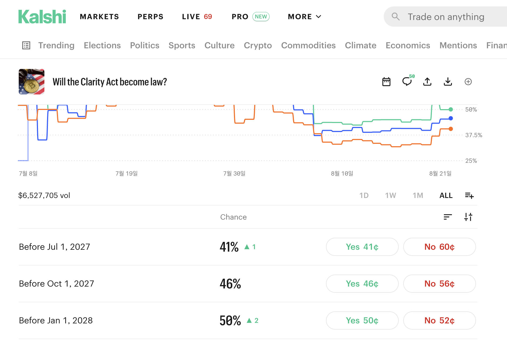

# Market Groups & Probability-Sum Semantics

**Goal:** make the **relationship between the markets inside one event** a first-class,
declared field — so Verex knows when outcome probabilities *must* sum to 100%, when they
*may not*, and never renders one as the other.

> Companion to [negative-risk-markets.md](negative-risk-markets.md). Neg-risk covers **one**
> group type (mutually exclusive). This doc covers the taxonomy around it — and the types
> where "sum = 100%" is simply the wrong question.

## Why — the observed puzzle

Kalshi, *"Will the Clarity Act become law?"* — three markets under one event:



| Market | YES |
|---|---|
| Before Jul 1, 2027 | 41¢ |
| Before Oct 1, 2027 | 46¢ |
| Before Jan 1, 2028 | 50¢ |
| **Sum** | **137%** |

This is **not** mispricing and **not** a display bug. The three markets are **nested**:
"before Jul 2027" ⊂ "before Oct 2027" ⊂ "before Jan 2028". They can all be YES at once (one
early passage resolves all three), so there is nothing forcing them to sum to anything. The
invariant that *does* apply here is **monotonicity** — 41 ≤ 46 ≤ 50 — and it holds.

The mistake to design against: assuming "outcomes under one event" ⇒ "probabilities partition
100%". That only holds for one of the group types below.

## Group taxonomy

| Group type | Example | Invariant | Σ YES | Neg-risk? |
|---|---|---|---|---|
| **Binary** — a single market | "Will X happen?" | YES + NO = 1 | 100% *by construction* (CTF split/merge) | n/a |
| **Exclusive + exhaustive** (categorical) | World Cup winner — 48 teams **+ "Other"** | exactly one YES resolves | **= 100%** (arbitrage-enforced) | ✅ yes |
| **Exclusive, non-exhaustive** | a candidate shortlist with no "Other" | at most one YES resolves | **≤ 100%** | partial |
| **Directional / nested** (Kalshi's term) | the screenshot; TSA "1M+ / 2M+ / 3M+ check-ins" | monotone: A ⊂ B ⇒ P(A) ≤ P(B) | **unbounded** (137% above) | ❌ no |
| **Independent / multi-winner** | "Which phrases will the Fed chair say?" | none | **= expected number of winners** | ❌ no |

Only row 2 makes "normalize to 100%" a meaningful operation. Applying it to the screenshot
would print 41/137 = **30%** for a market the book says is **41%** — a fabricated number.

## What Kalshi actually does

- **Two declared group kinds**, with different collateral treatment:
  - **Mutually exclusive market groups** — only one outcome can occur.
  - **Directional market groups** — nested outcomes, where one implies another.
- **Collateral return** (`netting_enabled`) exploits the group structure to cut margin:
  - *Exclusive:* No @ 60¢ on candidate A + No @ 70¢ on candidate B = $1.30 staked, but at
    least one pays $1 → the platform returns $1, so only **$0.30** is actually at risk.
  - *Directional:* Yes @ 80¢ on "1M+" + No @ 70¢ on "3M+" = $1.50 staked, guaranteed $1 back
    in the overlapping region → only **$0.50** at risk.
  - The flag is **locked at the user's first order in the event**, not per-order.
- **World Cup winner** is an exclusive group with an **"Other"/field bucket** so the outcome
  set is exhaustive. Even so, the *quoted* numbers over-sum in practice: summing every YES
  **ask** across the field lands around **105–112%** on the big tournament markets. That
  over-sum is the bid-ask spread and fees, not a probability claim.
- Kalshi's own explainer declines to call this "vig": it attributes YES+NO ≠ $1 to
  **transaction costs and spreads**, **one-sided volume**, and **differing information** —
  framed as market friction rather than a house margin.

## So what number is "real"?

The displayed % is a **last-trade or mid price on one side of a spread**, not a normalized
probability. For an exclusive + exhaustive group only a **band** is enforceable:

```
Σ best_bid_i  ≤  1  ≤  Σ best_ask_i
```

Cross either bound and there is a riskless trade (below). The true probability vector lives
inside that band; picking a single point inside it is a modeling choice, not a fact. Rules
Verex should adopt:

1. **Never normalize outside an exclusive group.** Show raw per-market prices.
2. When normalizing *is* valid, **label it** ("normalized") and keep the raw price reachable.
3. Compute the sum as a **diagnostic** — `Σ ask − 1` is the group's over-round, a liquidity
   quality signal worth surfacing to the MM agent, not to the casual trader.

## Why exclusive groups actually sum to 100% on Verex

The neg-risk stack ([negative-risk-markets.md](negative-risk-markets.md)) makes it an
*arbitrage* fact, not a convention. Converting NO shares over a set `S` of `k` outcomes
yields 1 YES for every outcome **not** in `S`, plus **(k−1) USDC**. Both directions close:

- **Σ YES ask < 1** → buy one YES of every outcome for less than $1; exactly one resolves →
  $1 guaranteed. Free money, so the asks get lifted back up to 1.
- **Σ YES bid > 1** → equivalently Σ NO ask < N−1; buy every NO, convert the full set
  (`k = N`) → receive **$(N−1)** cash immediately for less than $(N−1). Same trade, mirrored.

Directional groups have **no such conversion** — nested outcomes aren't a partition, so there
is no complete set to mint or redeem. Their invariant (monotonicity) can only be enforced
**off-chain**, in the MM agent and in validation.

## Design for Verex

- **Declare the group on the event**, don't infer it:
  `group_type ∈ { binary | exclusive | exclusive_open | directional | independent }`,
  plus ordered `member` markets (order is meaningful for `directional`).
- **`exclusive`** → route to the Neg Risk Adapter + Neg Risk CTF Exchange; Σ = 1 is enforced
  by arbitrage. `exclusive_open` (no "Other" bucket) → Σ ≤ 1, so **no** neg-risk conversion.
- **`directional`** → independent binary CTF conditions + an off-chain **monotonicity
  invariant**. The MM agent must never quote a crossing pair (a later threshold priced under
  an earlier one), and the indexer should flag violations rather than silently serve them.
- **`independent`** → no invariant at all; the UI must not draw a share-of-100% bar.
- **Web UI, per type**: exclusive → normalized bar / ranked list; directional → a cumulative
  curve over the ordered thresholds (the shape the screenshot's chart is really showing);
  independent → plain per-row odds, no aggregation.
- **API / indexer** → expose `group_type`, the member list, and a `sum_yes` diagnostic
  (bid-sum, ask-sum, over-round) per group.
- **Collateral netting** (Kalshi's collateral return) is the capital-efficiency prize on top —
  CTF has no native cross-condition netting, so it needs either the neg-risk adapter
  (exclusive only) or an off-chain margin engine (directional). Treat as a later item.

## Open questions
- Do we enforce Σ = 1 **on-chain** (neg-risk, exclusive only) or merely surface it? Deciding
  this fixes whether `exclusive_open` is even offerable.
- Directional groups: N separate binary conditions + off-chain invariant, or a single
  **scalar / range** market with bucketed payouts? The latter enforces monotonicity by
  construction but is a new condition type.
- Is an **"Other" bucket mandatory** for every `exclusive` event? It's what makes the group
  exhaustive — ties directly into augmented neg risk's Named / Placeholder / Other model.
- Does the MM agent get a group-aware quoting mode (quote the *vector*, respecting the
  invariant), or per-market quoting plus a rejection filter?

## Features
- [ ] **`group_type` on events** — enum + ordered members, declared at creation, surfaced by the API
- [ ] **Per-type invariant validation** — Σ = 1 (exclusive) · Σ ≤ 1 (exclusive_open) · monotone (directional) · none (independent)
- [ ] **Sum diagnostics** — bid-sum / ask-sum / over-round per group, for the MM agent + ops
- [ ] **Normalization rule in the web UI** — normalized display only for `exclusive`, always labeled, raw price still reachable
- [ ] **Directional group UI** — cumulative curve over ordered thresholds instead of a 100% bar
- [ ] **MM-agent group awareness** — never quote a monotonicity-crossing or arbitrage-open vector
- [ ] **Collateral netting** (later) — exclusive via neg-risk conversion; directional needs an off-chain margin engine
- [ ] (you) Decide on-chain enforcement vs surfacing; N-binary vs scalar market for directional; mandatory "Other" bucket

## Resources
- Kalshi — Collateral return (mutually exclusive vs directional groups, `netting_enabled`):
  <https://help.kalshi.com/en/articles/13823816-collateral-return>
- Kalshi — How to read prices as probabilities (why YES + NO ≠ $1):
  <https://news.kalshi.com/p/how-to-read-probabilities>
- Kalshi — World Cup group winner (a live exclusive group):
  <https://kalshi.com/markets/kxwcgroupwin/world-cup-group-winner/kxwcgroupwin-26a>
- Polymarket Neg Risk Adapter (conversion op that enforces Σ = 1):
  <https://github.com/Polymarket/neg-risk-ctf-adapter>
- Source screenshot: [`docs/images/kalshi/kalshi-100percent.png`](../images/kalshi/kalshi-100percent.png)
