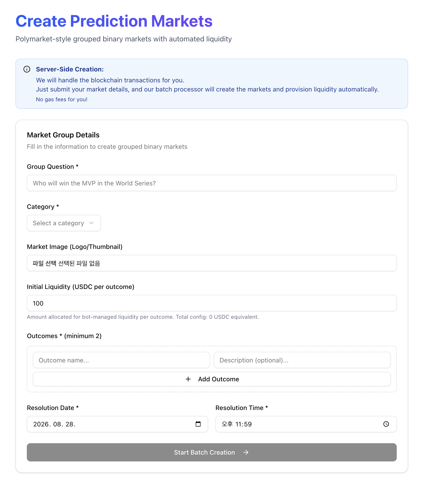

# 28th July Tasks for Verex

## Overview
This is the follow-up features to the lastest implementation. You can create only one branch for all these following tasks.

## Before the implementation
- Create only one branch for all these following tasks.
- You should make create several commits that are coherent.
- It's better to implement each task serially because it make the commits more apparant and some feature should be based on the previous one.
- You should explain your idea of how to implement them in later part of /Users/jay/work/verex/docs/tasks/jun-19-verex-design.md before I agree your idea and ask you to go ahead.

## Tasks

### Multi Outcomes
We only have binary markets but we should have multiple outcome market like who wins Worldcup.

- you can refer to my previous project's code but don't copy it as it is change something for avoiding copyright issue and more advanced algorithm. The path is /Users/jay/work/nostra-server.
- Create some seed for multipule outcome markets like who win the Homerun durbey in MLB all star day or who will world series champion or you can refer polymarket site https://polymarket.com/

### Create Market

As you can see the screen shot, user can create a market with operator's fund support.

- Operator's USDCs are used for creating Yes/No tokens.
- you can refer to my previous project's code but don't copy it as it is change something for avoiding copyright issue and more advanced algorithm. The path is /Users/jay/work/nostra-server.

### Faster Trading, Resolution, Redeem
- Current UX is very inconvenient for user trading because a user should waiting completion. 
- Make the action complete faster with a basic operation. I think contract interactions can be made in API server asychronosly with timer or thread.
- Anyway I will check your idea for this task.

### Top menu for usage
Describe how to trade with existing demo wallets, how to resolve with Operator wallet, how to check the portfolio, how to redeem in the portfolio page, and how to create a market.

- You can careate screen shots for more details.

## After the implementation
- Summarize what you did in the history file technically