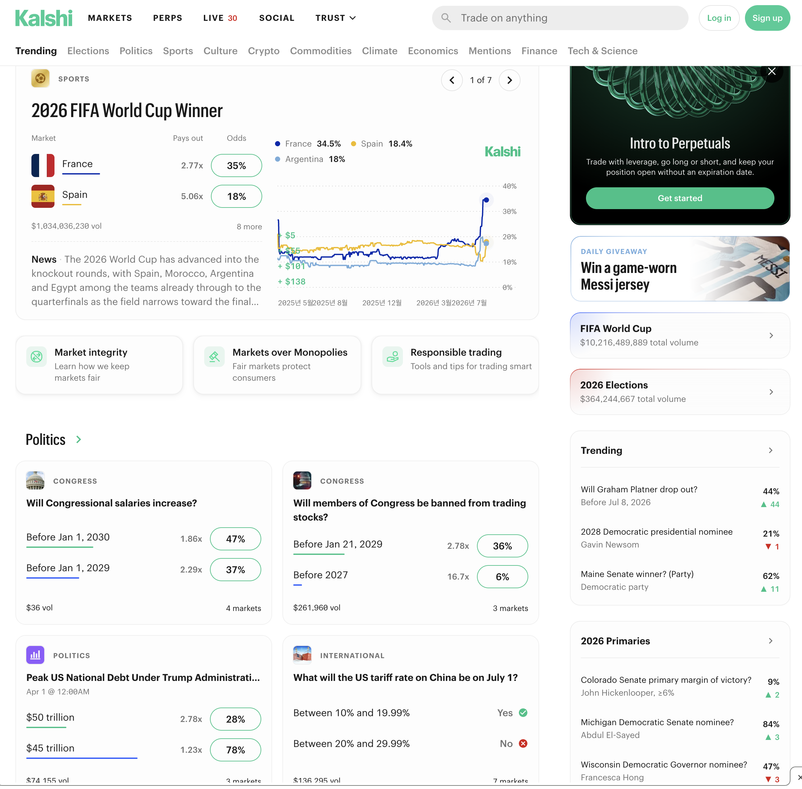
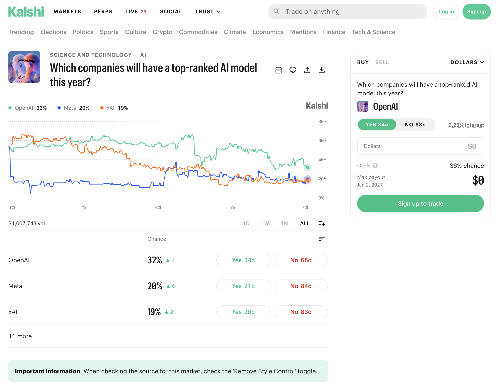

# Jun-19 Verex — Design & Task Breakdown

> Design doc derived from [`jun-19-verex.md`](jun-19-verex.md). Reference UI:
> [`images/homepage.png`](images/homepage.png) (Polymarket-style). _(2026-06-23)_

## Task map
| # | Area | Status |
|---|------|--------|
| 1 | **Basic Web UI** — Kalshi-referenced, **binary** markets, **real CTF contracts on anvil** | ✅ **built 2026-07-06** (shadcn UI + on-chain trading; see addendum 2) |
| 2 | **Deploy to GCP** + Cloud SQL DB + domain `verex.jaylabs.xyz` | ready to build — **blocked on chain decision** (see Task 2 addendum) |

## Decisions (proposed — confirm)
| Topic | Proposed | Note |
|-------|----------|------|
| Web app | `packages/web` (Next.js 14, App Router) | existing scaffold (`layout.tsx`, `page.tsx`) |
| Data layer | ~~DB-only~~ → **real CTF contracts (anvil) + DB mirror** | superseded 2026-07-06 per jay: "use real contract for the market" |
| DB | **Cloud SQL for PostgreSQL** + **Prisma** | consistent with rabbit; verex has no DB yet |
| API | **Next.js route handlers + Prisma** in `web` | simplest for DB-only; alt = existing `packages/api` (Fastify) — **open Q** |
| Market type | **Categorical** (N outcomes; binary = N=2) | per spec |
| Domain | **`verex.jaylabs.xyz`** (subdomain) → Cloud Run | spec names this exact host |
| Deploy pattern | mirror rabbit `scripts/deploy.sh` (secrets → Secret Manager) | reuse known-good flow |
| UI kit | **shadcn/ui + Tailwind** | see [Task 1 addendum](#task-1-addendum--ui-stack--design-similarity-risk-2026-07-06) — research + legal-risk notes |

> 💸 Cost: Cloud SQL bills monthly even when idle (~$8–10+ smallest tier).

---

## Task 1 — Basic Web UI (prediction market)

Build a Polymarket-style UI driven entirely by the database (no contract integration yet).

### Screens (from `images/homepage.png`)
- **Top nav:** logo, search, "How it works", Login/Sign-up (reuse Auth.js Google login).
- **Category tabs:** Trending, Politics, Sports, Crypto, … (from `Market.category`).
- **Featured market** (large card): title, **categorical outcomes with % (implied probability)**, a probability-over-time chart, volume, close date.
- **"All markets" grid:** market cards — title, image/icon, top outcomes with %, volume.
- **Sidebar:** "Hot topics" list (by volume). *(Nice-to-have; can defer.)*
- **Market detail page** (`/market/[slug]`): all outcomes + prices, chart, description, and a
  **(mock) trade panel** — buys recorded in the DB, no on-chain calls.

### Data model (Prisma) — draft (review & adjust)
```prisma
// prisma/schema.prisma
generator client { provider = "prisma-client-js" }
datasource db { provider = "postgresql"; url = env("DATABASE_URL") }

enum MarketStatus { OPEN  RESOLVED  CANCELLED }

model Market {
  id          String       @id @default(cuid())
  slug        String       @unique
  title       String
  description String?
  category    String?                              // "Politics","Sports","Crypto"…
  imageUrl    String?
  status      MarketStatus @default(OPEN)
  volume      Decimal      @default(0) @db.Decimal(20, 2)
  closesAt    DateTime?
  resolvedOutcomeId String?                         // winning outcome once RESOLVED
  createdAt   DateTime     @default(now())
  updatedAt   DateTime     @updatedAt
  outcomes    Outcome[]

  @@index([category, status])
}

model Outcome {
  id        String  @id @default(cuid())
  marketId  String
  market    Market  @relation(fields: [marketId], references: [id], onDelete: Cascade)
  label     String                                  // "Yes"/"No" or "Candidate A"…
  price     Decimal @db.Decimal(10, 6)               // implied probability 0..1
  sortOrder Int     @default(0)

  @@index([marketId])
}
```
Optional later: `PricePoint` (chart history), `Position`/`Trade` (mock trading per user).
Open: include mock trading in v1, or read-only display first?

### To-do (who does what)
| You (jay) | Me (Claude) |
|---|---|
| Confirm API choice (Next.js routes vs `packages/api`) | Add Prisma + schema + migration |
| Confirm v1 scope: read-only vs mock trading | Build homepage (tabs, featured, grid) + market detail |
| Approve seed markets (how many / which categories) | Seed sample **categorical** markets to match the screenshot |
| | Wire list/detail API routes (DB-backed) |

---

## Task 1 addendum — UI stack & design-similarity risk (2026-07-06)

### UI stack: recommendation = shadcn/ui + Tailwind

Current `packages/web` is bare Next.js 14 (no Tailwind, no component lib, hand-rolled CSS) — the
source of the "awkward" look. Research summary (2026 landscape):

| Option | Fit for Verex | Verdict |
|--------|---------------|---------|
| **shadcn/ui** (+ Tailwind, Radix primitives) | De facto standard for Next.js; **copy-in code you own** (no dep lock-in) → full freedom to build our own visual identity; `shadcn charts` (Recharts) covers the probability chart; a11y from Radix | ✅ **pick** |
| Mantine | Batteries-included, strong for data-dense B2B dashboards; own styling system (not Tailwind) | good, but heavier identity to override |
| MUI | Enterprise breadth (data grid etc.) | Material look fights a Polymarket-style feed |
| HeroUI / daisyUI / Aceternity | lighter or animation-focused | not aimed at data-dense trading UI |

Why shadcn specifically for us: (1) 2026 trend is headless/Tailwind-first — shadcn is its center of
gravity, best AI-tooling + ecosystem support; (2) copied-in source = we can diverge the theme
tokens (colors/typography/radius) from both Polymarket **and** any prior work, which is exactly
what the risk section below needs; (3) jay already knows it — lowest learning cost.

Implementation note: Task 1 build starts with `tailwindcss` + `shadcn init` in `packages/web`
(theme tokens defined once in `globals.css`), then the screens in the spec above.

### Design-similarity legal risk (prior employer / Polymarket) — mitigation plan

Context: jay built a similar Polymarket-style UI with shadcn at a previous company; concern is a
future claim that Verex copies that work. Not legal advice — framework + hygiene below; for real
assurance have an IP/employment lawyer read the old employment contract.

**How the law sees it (US frame; KR analog in parens):**
- **Copyright** protects concrete code and specific graphic assets — not layouts, UX flows, or
  functional concepts. (KR 저작권법 similar: 아이디어/기능 배제.)
- **Trade dress** can protect overall "look and feel" but requires distinctiveness,
  **non-functionality**, and consumer confusion — a high bar for a functional, genre-standard
  prediction-market feed. (KR: 부정경쟁방지법 성과물 도용 조항(파목)이 가장 넓은 catch-all.)
- The realistic risk is therefore **not** "similar layout" but (a) **reused code/assets** and
  (b) **employment-contract clauses** (IP assignment, confidentiality, non-compete).

**Mitigation checklist (do these; mostly already repo policy):**
- [ ] **Zero reuse**: no code, components, Figma files, configs, seed copy, or screenshots from the
      previous company — clean-room rebuild only. (Using shadcn again is fine: MIT-licensed generic
      building blocks; a library choice isn't ownable.)
- [ ] **Differentiate identity from BOTH Polymarket and the prior project**: own palette,
      typography, icon set, naming, copy — layout/density inspiration only, per README §2.2.6.
      One divergence step protects against both claim sources.
- [ ] **Provenance trail**: fresh git history + `docs/history/` decision log (already the
      convention) shows independent creation with dates — the strongest practical defense.
- [ ] **Contract check (jay)**: reread prior employment contract for IP-assignment scope,
      confidentiality, and non-compete duration; that clause set — not UI similarity — decides the
      actual exposure. Lawyer review if any clause is broad or ambiguous.
- [ ] **No confidential inputs**: don't consult the old product, its repo, internal docs, or
      metrics while building Verex screens; work from Polymarket's public site + this spec only.

Sources: [Untitled UI — React component libraries 2026](https://www.untitledui.com/blog/react-component-libraries) ·
[Dualite — shadcn/MUI/Radix compared](https://dualite.dev/blogs/best-ui-component-libraries) ·
[C&C IP — UI/UX legal protection: trade dress vs copyright](https://www.candcip.com/single-post/legal-protection-of-user-interface-and-user-experience-design-comparing-trade-dress-copyright-and) ·
[Harvard — look & feel: copyright or trade dress](https://cyber.harvard.edu/property/protection/resources/byerly_unedited.html) ·
[Proskauer — website trade dress claims](https://newmedialaw.proskauer.com/2013/11/07/trade-dress-can-be-viable-means-of-protecting-websites-from-competitors-look-alike-sites/)

### Main page UI
We can use this screen shots from Kalshi
1) Main page


### Detail page UI
We can use this screen shot from Kalshi

---

## Task 1 addendum 2 — as built (2026-07-06)

Implemented on branch `claude/deploy-export-log` per jay's "working version, complete features" directive:

- **UI**: Tailwind + shadcn (manual copy-in: button/card/badge/input/tabs/separator) with a
  distinct Verex identity (indigo primary, emerald Yes / rose No — NOT the Kalshi mint).
  Main page: nav (search + faucet + demo-wallet selector), category tabs, featured market with
  Recharts probability chart, market grid, hot-markets sidebar. Detail page: chart, outcome rows,
  rules + conditionId, recent activity, sticky Buy/Sell trade panel.
- **Real contracts**: every market is an on-chain CTF condition on anvil (seed deploys the
  backbone via `DeployCTF.s.sol`, then `prepareCondition` → `registerToken` → operator splits
  10k USDC inventory per market). Addresses live in the DB (`ChainConfig`) — no env coordination.
- **Trading**: every Buy/Sell is a real `CTFExchange.fillOrder` tx — the user (demo anvil
  account 1–5, keys server-side) signs the maker order, the operator (account 0) fills from its
  inventory. Auto-faucet keeps the flow one-click. DB mirrors each fill: price impact (linear,
  L=2000 USDC), volume, trade log, chart point. Production wallet path (MetaMask → AA session
  keys) stays the S7 track.
- **Run locally**: `anvil` → `pnpm --filter @verex/api db:reset` (migrate + deploy + seed) →
  `pnpm --filter @verex/api dev` → `pnpm --filter @verex/web dev`.

## Task 2 addendum — GCP setup summary (2026-07-06): jay's actions vs Claude's

**⚠️ New decision needed first — where does the chain live in the cloud?** Task 1 now trades
against anvil, which is local-only. Options for `verex.jaylabs.xyz`:

| Option | What it means | Trade-off |
|--------|---------------|-----------|
| **(a) Testnet (recommended)** | Deploy CTF backbone to a public testnet (e.g. Base Sepolia); operator key in Secret Manager | Real public chain, demoable anywhere; needs faucet ETH + key management |
| (b) Hosted anvil | Run anvil in a Cloud Run/GCE container | Fast, but state resets on restart — toy-grade |
| (c) DB-only fallback | Cloud version reads DB, trading disabled ("local demo only" banner) | Cheapest; loses the headline feature in the cloud |

**jay does (needs your accounts/access):**
1. Decide the chain option above (a/b/c) — blocks everything else.
2. Pick the **GCP project**: reuse `doubletree-498007` (rabbit) or create a new one; confirm **billing** is on.
3. ~~Be ready at the registrar~~ → **almost nothing** (updated 2026-07-06): `jaylabs.xyz`'s
   nameservers are `ns-cloud-e*.googledomains.com` — the zone lives in **Cloud DNS**, so Claude
   can add the `verex` record via `gcloud dns`. jay's only possible action: click **Verify** in
   Google Search Console if Cloud Run demands domain-ownership verification (Claude adds the TXT
   record; the verify click needs jay's Google account).
4. If option (a): fund the operator address with testnet ETH (faucet) and approve storing its private key in Secret Manager.
5. If Google login ships: add the production **OAuth redirect URI** in Google Cloud Console.
6. Accept the standing cost: Cloud SQL smallest tier ≈ **$8–10+/month even idle** + Cloud Run per-use.

**Claude does (scriptable, no jay input needed):**
1. **Cloud SQL** Postgres instance + database + user; run migrations; put `DATABASE_URL` in **Secret Manager**.
2. **Two Cloud Run services**: `verex-api` (Fastify — trading needs it in the cloud now) and `verex-web` (Next.js), with `API_URL` wired web→api.
3. `scripts/deploy.sh` mirroring rabbit's shape (build → push secrets → `gcloud run deploy --set-secrets`).
4. **Domain mapping** `verex.jaylabs.xyz` → `verex-web`; hand jay the DNS record to add.
5. If option (a): deploy `DeployCTF.s.sol` to the testnet, re-run the seed against it, store operator key in Secret Manager.
6. Smoke test in the cloud + history log entry.

---

## Task 2 — Deploy to GCP + DB + domain (`verex.jaylabs.xyz`)

### Plan
- **Cloud SQL Postgres** instance + DB + user; `DATABASE_URL` → Secret Manager.
- **Cloud Run** deploy of `packages/web`; connect to Cloud SQL.
- **Domain mapping** `verex.jaylabs.xyz` → the Cloud Run service.
- Reuse rabbit's `deploy.sh` shape (push secrets to Secret Manager, `--set-secrets`).

### To-do (who does what)
| You (jay) | Me (Claude) |
|---|---|
| Confirm **billing enabled** on the GCP project | Create Cloud SQL instance + DB + user |
| ~~Edit DNS at the registrar~~ — zone is on **Cloud DNS**; only click **Verify** in Search Console if prompted | Write `verex/scripts/deploy.sh` (mirror rabbit) |
| (DNS record itself: Claude adds via `gcloud dns`) | Run `gcloud run domain-mappings create` for `verex.jaylabs.xyz` + add the CNAME in Cloud DNS |
| Update OAuth redirect URI if login is used | Set `AUTH_URL`, push secrets, deploy |

> Which **GCP project** for verex? Rabbit uses `doubletree-498007`; reuse it or a separate project?

---

## Delivery process (from the task's "After the implementation")
1. **Summarize** what was done in `docs/history/` (per verex convention).
2. **Commit + push** on a new branch `claude/<topic>`.
3. **Create a PR**, then **merge it** — the task explicitly authorizes merging (this overrides the
   repo's usual "leave the PR for jay" default, but I'll still pause for your review first).

---

## Open questions for jay
1. **API layer:** Next.js route handlers (simplest) or the existing Fastify `packages/api`?
2. **v1 scope:** read-only market display, or include **mock trading** (DB-recorded buys)?
3. **Auth:** homepage public, login only for trading? (Auth.js Google login already scaffolded.)
4. **Seed data:** how many sample categorical markets, and which categories?
5. **Chart:** static seeded prices, or simulate price movement for the probability chart?
6. **GCP project:** reuse `doubletree-498007` or a separate project for verex?
7. **Cloud SQL tier:** smallest (shared-core) OK?

## When ready
Say **"go"** and I'll build everything on a **single branch** — `claude/jun-19-verex`
(Tasks 1 + 2 together) — pausing for review before any commit. Per the task's
"after the implementation": summarize in `docs/history/`, push, open a PR, then merge.
