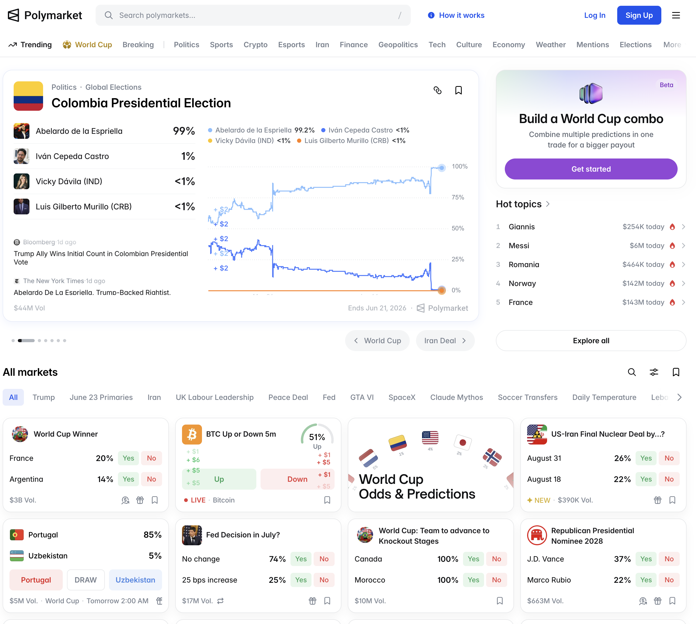

# 19th June Tasks for Verex

## Overview

You already did the great thing to implemented as we planed. I want you to do the main items as describe as follows.
- Basic Web UI for prediction market
- Deploy to GCP with complete DB instance

## Tasks

### Basic Web UI for prediction market
- It should be provided with an screen shot that would be Polymarket pages.
- You can make a prediction market like this with basic like this screenshot 
- There should be one kind of marekt that is a categorical market.
- Initailly It doesn't have to cooperated with smart contracts but just have all data in database

### Deploy to GCP with complete DB instance
- Deploy the code to verex.jaylabs.xyz
- I already purchased a domain named jaylabs.xyz we can create a web site with this domain.
- Show me how to set for Verex project in the domain. You can recommend an URL for this project.

## After the implementation
- Summarize what you did in the hisotry folder
- Commit and push it to github with new branch
- Create a PR an merge it